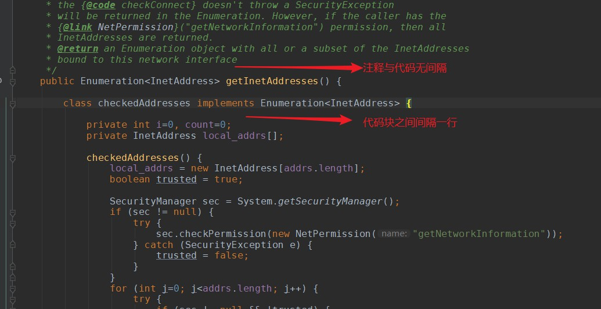
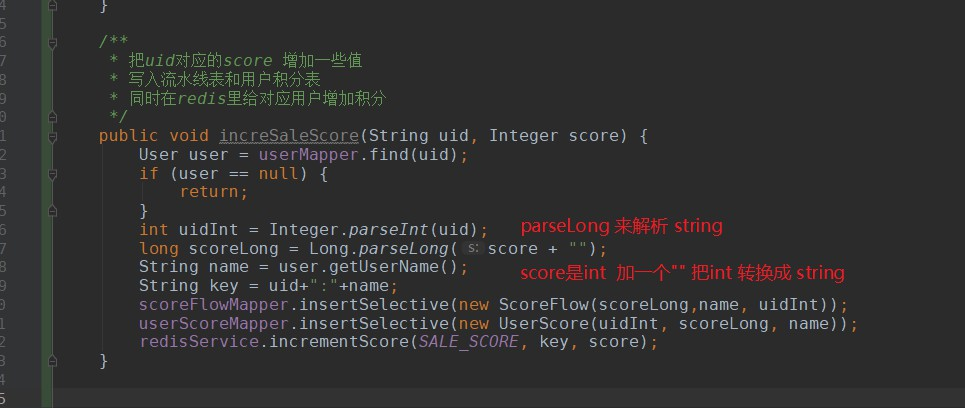
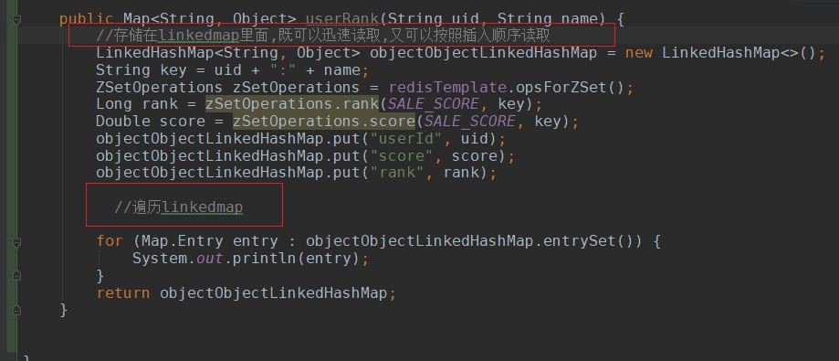
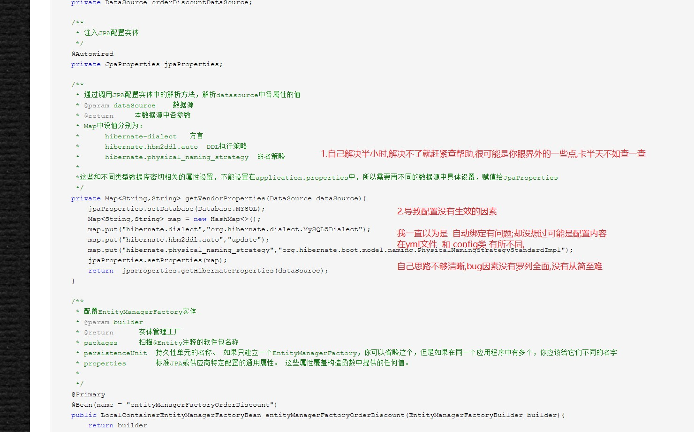
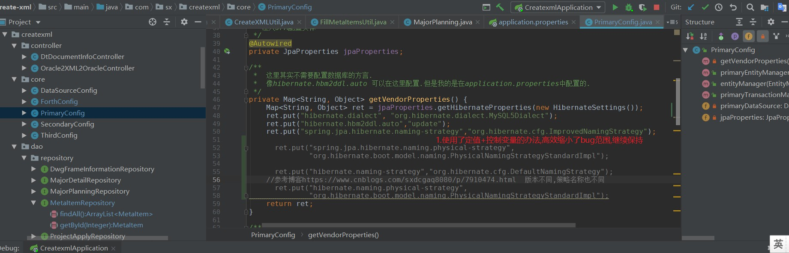

# coding-reflection
1.反思代码2.收藏精妙代码3.debug反思

## 反思
[《重构：改善既有代码的设计》读书笔记（一）](https://juejin.im/post/5b81122d51882527246c9cfd)  

有时间一定要读 <代码大全>  和 <重构 改善既有代码质量>  

+ 代码要一步步写 一步步试,而不是写了一堆再去运行,不然出错了不好定位bug
+ 需求一定要定清楚了再写代码,尤其是尽量不要改动底层pojo,不然代码要翻新好多
+ list,map这种数据结构尽量不要超过两层,不然就会很难想;可以用新建一个类来代替多层的关系
+ if(a==1)与if(1==a)的区别是 为了防止写成a=1,而不报错;"abc".equals(str)与str.equals("abc")的区别是可以避免空指针异常
+ 可以用三元表达式来代替简单if else 语句
+ 可以用提前return来简化if else结构
+ stringbuilder在循环中的字符串拼接性能远高于  +号的字符串拼接,因为stringbuilder始终只创建了一个字符串,而+号是在不断地创建
+ 
## 收藏

try catch

代码块间隔规则

Long.parselong

[LinkedHashMap 神器!](https://blog.csdn.net/justloveyou_/article/details/71713781)

## debug
+ 控制变量,当变量较多时,把变量改成常量来运行
+ 条件断点和异常断点的使用
+ 认真思考报错信息
+ 如果查找报错信息没有找到好的解决办法,可以通过查找正确的代码来"对比debug" 例如之前oracle双库的事务bug

+ 
+ 

